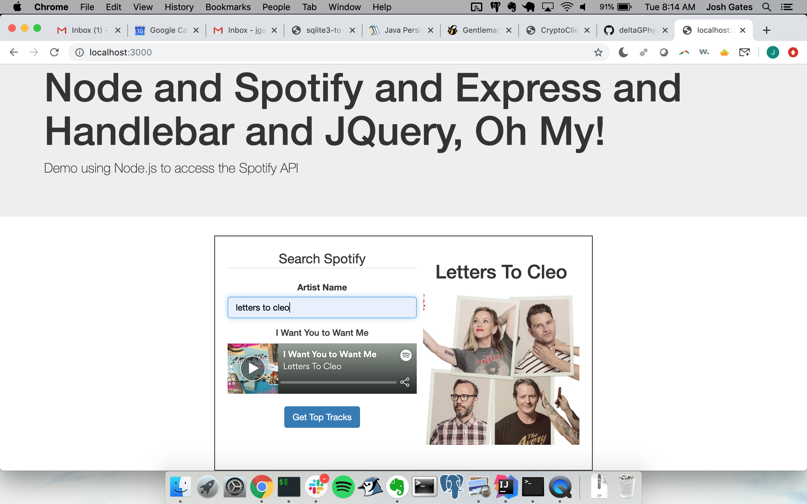
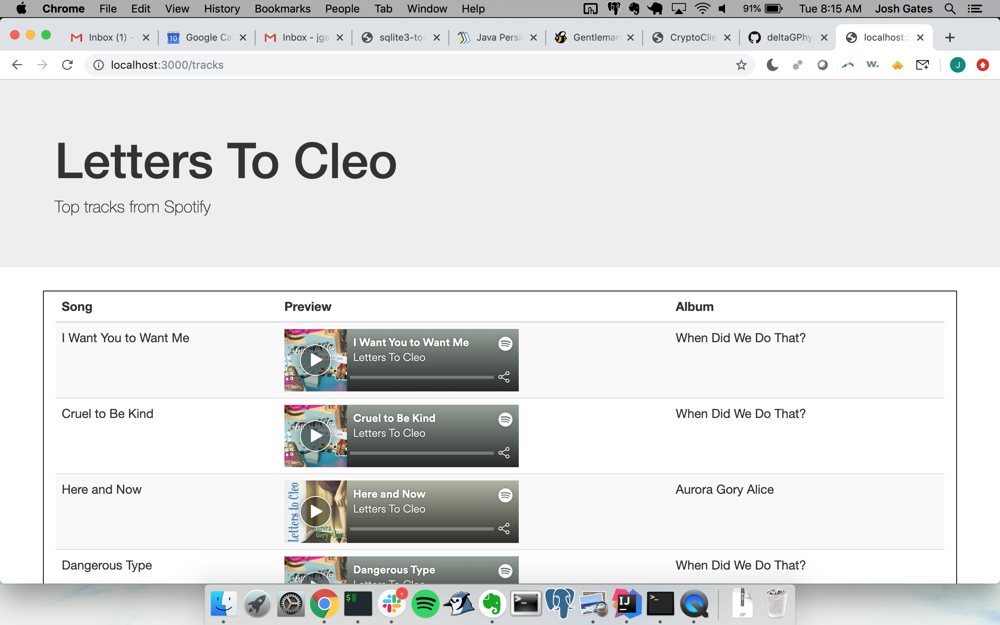

# Node-Spotify
Simple Node app to use the Spotify API to retrieve a song from your favorite band - uses Node, Handlebars, JQuery, and Bootstrap. In addition to the embedded player, a link show the band's top ten songs

### Examples

